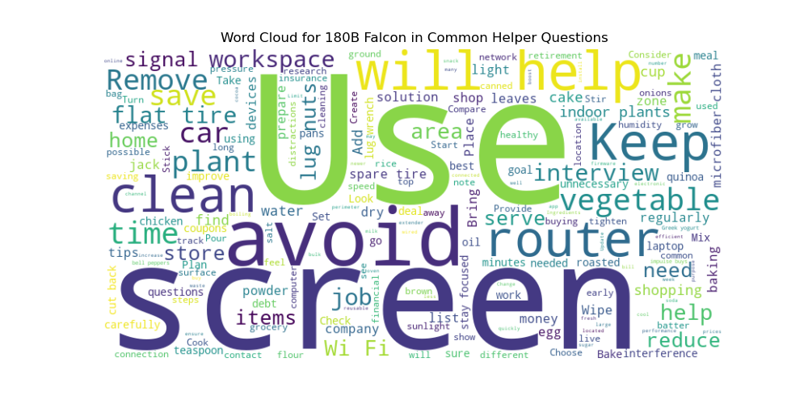

# Privacy-first On-Device LLMs 

---

# The problem

* LLMs are great BUT
* They require specialized hardware to run (Big GPUs, $40,000 servers)
* Most popular services are therefore ran in the cloud (ChatGPT, Claude, Bard, Huggingface Chat etc...)
* In order to use them for sensitive topics, you need to consent to giving "Big Tech" your personal information.

---

# A solution? On-Device LLMs

* On-device LLMs are possible, but are much smaller than cloud/enterprize options
* for example GPT-3.5 has 175 billion parameters (it tracks that many "relationships" in text via its neural network) but most models you can run on your laptop have only 7 billion parameters (sometimes 13 if you have a fancy and expensive gaming laptop)

---

# LLM Leaderboard
* Compares open-source models of varying parameter counts 7-180 billion and beyond
* Uses standard tests and compares their scores (ARC, HellaSwag, MMLU etc..)


https://huggingface.co/spaces/HuggingFaceH4/open_llm_leaderboard

---

# My Testing Setup
* Compare [Falcon 180B](https://huggingface.co/tiiuae/falcon-180B) (one of the most sophisticated open-source LLMs, comparable to GPT-3.5 but a little worse than GPT-4) available with GPU inference on [HuggingFace Chat](https://huggingface.co/chat/) to
* [Falcon 7B](https://huggingface.co/tiiuae/falcon-7b) available for offline, privacy friendly local chat on my laptop via [GPT4ALL](https://gpt4all.io/index.html)

---

# Testing 

* I'm going to give each model 100 questions across the following categories:
    1. **Personal Questions**
    2. **Common Helper Questions**
    3. **Logical Reasoning Questions**
    4. **Text Completion and Comprehnsion**
    5. **Programming and Code Generation**
    6. **Creative Writing and Storytelling**
    7. **Translation and Language Proficiency**
    8. **Current Events and Information Retrieval**
    9. **Mathematical Problem Solving**
    10. **Philosophical and Ethical Questions**

* Bad Example 1: Math
  
  


* Bad Example 2: Logical
  
  

* Bad Example 3: Logical
  
  

* Similar Example 1: Sentence Completion
  
  

* Similar Example 2: Helper
  
 


--- 

# Analysis 

* I've record the answers and score each question in a big .csv file
* I've done analysis of each test with pandas, matplotlib etc to assess the accuracy, helpfulness, length, word clouds etc. 

---

# My Own Pruning (Consideration)

* I'm using a pre-pruned 7B model created by TII
* I'm using GPT4ALL to run inference on my laptop
* I could get access to an A100 or better GPU and prune and train my own model with Pytorch or Tensorflow
* I could also write my own inference code for these models, to better guarantee privacy because while GPT4ALL is open source it could theoretically still be sending my private info to the UAE or something 


# Python Virtual Environment Setup Guide

Follow these steps to create a new virtual environment, activate it, and install packages from a `requirements.txt` file.

## Step 1: Create a New Virtual Environment

First, you need to create a virtual environment. Replace `env_name` with the desired name for your virtual environment.

### For Windows or Mac:

```bash
python -m venv env_name
or
python3 -m venv env_name
```

## Step 2: Activate the Virtual Environment
After creating the environment, you need to activate it.

```bash
For Windows:

env_name\Scripts\activate

For macOS and Linux:

source env_name/bin/activate
```
You should now see (env_name) before your command prompt, indicating that the virtual environment is active.

## Step 3: Install Packages from requirements.txt
Ensure that you have a requirements.txt file in your current directory. 
This file should contain the list of packages to install.
Run the following command to install all the packages listed in requirements.txt:

```bash
pip install -r requirements.txt
```
After running the above command, 
all the packages and their respective versions should be installed in your virtual environment.

## Step 4: Python Scripts

python python_scripts.py

### Summary of Python Analysis Scripts

#### analysis_Low_Accuracy_Summary.py
This script identifies and extracts records where the Accuracy Score is less than 3, saving the results to a dedicated file `Low_Accuracy_Summary.csv`.

#### score_filter.py
The purpose of this script is to process and filter out entries with low scores. It outputs several files including `score_eq_1.csv`, `score_le_2.csv`, and `score_le_3.csv`, each containing data corresponding to the filter criteria.

#### fill_with_word_count.py
This script populates two columns, `Length 180B Falcon` and `180B Falcon Response`, with appropriate data. It produces an output file named `On-Device-score_with_fill_Length.csv`.

#### analysis_score_mean.py
Designed to compute the average scores, this script then saves the computed summary to the file `Category_Scores_Summary.csv`.

#### analysis_word_graph.py
A script for tallying high-frequency vocabulary in the results. It generates images like:

All visualizations are stored in the `word_graph` directory.

#### analysis_accuracy_score_sum_diff.py
This analysis tool generates a visual representation of the variations in Accuracy Scores, saved as `analysis_accuracy_score_sum_diff.png`.

#### analysis_helpfulness_score_sum_diff.py
With a focus on evaluating differences in Helpfulness Scores, this script outputs its findings in an image file named `analysis_helpfulness_score_sum_diff.png`.

#### analysis_word_count_diff.py
The script is tasked with examining the discrepancies in Answer Word Counts and visualizing the results in `analysis_word_count_diff.png`.